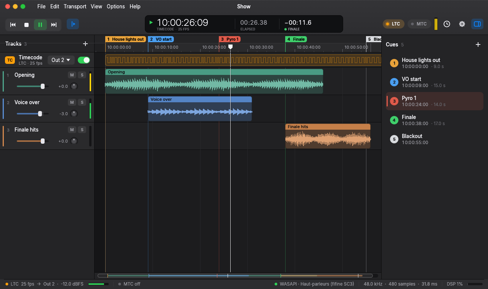

<p align="center"></p>

<h1 align="center">CueLine</h1>

<p align="center"><b>A tiny, fast timeline player that generates sample-accurate SMPTE LTC and MIDI Timecode.</b><br>
Load your show audio, place cues, press Space, and drive lights, video and pyro in perfect sync.</p>

<p align="center"></p>

---

CueLine borrows the parts of a DAW that matter for timecode playback (tracks, waveforms, markers,
a timecode ruler) and leaves everything else out. You get a single ~8 MB executable with no
installer, no runtime and no plug-ins, built around one goal: **timecode that is exactly where the
audio is.**

## Features

- **LTC (SMPTE 12M) generated inside the audio callback.** It shares a buffer with the program
  audio, so it stays locked to the sample: no drift, and no offset between music and timecode.
  Seeks, pauses and buffer-size changes never produce a broken frame.
- **MIDI Timecode** (quarter-frames + full-frame on locate) runs on a time-critical thread and is
  scheduled against a DLL-filtered model of the audio clock, compensated for output latency.
  Measured worst-case scheduling error: **under 0.3 ms**.
- All SMPTE rates: **23.976, 24, 25, 29.97 drop-frame, 29.97 non-drop, 30**, any start
  timecode, plus LTC user bits.
- Multitrack playback with **waveforms**, volume, pan, mute and solo, sample-exact clip offsets
  and frame snapping.
- **Markers / cue list** with live highlight, a countdown to the next cue, colours, and
  drag-to-move.
- Flexible **output routing**: program on any channel(s) and LTC on its own output (the classic
  stereo setup is *music left, LTC right*).
- **Offline WAV export** (24-bit): LTC only, mix + LTC, or stereo mix + LTC. Rendered by the very
  same engine, so the file is bit-identical to live playback.
- **Big timecode window** for a second screen, a DSP load meter, peak meters, undo/redo, drag &
  drop, automatic reconnection when an audio device drops out, Reaper-style shortcuts.
- Decodes WAV, AIFF, FLAC, MP3, AAC/M4A, ALAC and Ogg Vorbis; files are converted once to the
  device rate with a high-quality FFT resampler.

## Download & run

Grab `CueLine.exe` from the [releases page](https://github.com/naileclevrai/CueLine/releases) and
run it. That's it. Settings live in `%APPDATA%\CueLine\settings.json`, projects are `.cueline`
JSON files that store media paths relative to the project.

## Build from source

Requires a stable [Rust toolchain](https://rustup.rs) (and, on Windows, the MSVC build tools).

```bash
cargo build --release
```

The executable ends up in `target/release/CueLine.exe`. Run the test suite with:

```bash
cargo test --workspace
```

### ASIO (optional)

WASAPI is used by default. To build with Steinberg ASIO support, install LLVM, download the ASIO
SDK, point `CPAL_ASIO_DIR` at it, then:

```bash
cargo build --release --features asio
```

## Keyboard shortcuts

| Keys | Action |
| --- | --- |
| `Space` | Play / stop (returns to where playback started) |
| `Shift+Space` | Pause at the current position |
| `Home` / `End` | Go to project start / end |
| `←` / `→` | Nudge one frame (`Shift`: one second) |
| `G` | Go to timecode |
| `M` | Add marker at the playhead |
| `[` / `]`, `1`…`9` | Previous / next marker, jump to marker *n* |
| `F` / `B` / `Z` | Follow playhead / big timecode window / zoom to project |
| `Ctrl+Wheel`, `+` / `−` | Zoom |
| `Ctrl+Z` / `Ctrl+Y` | Undo / redo |
| `Ctrl+I` / `Ctrl+E` | Import audio / export WAV |

## How the timing works

See [docs/ARCHITECTURE.md](docs/ARCHITECTURE.md) for the details. In short:

1. The audio thread never allocates, locks or blocks. The UI talks to it through a lock-free
   ring buffer and atomics.
2. The LTC level of every sample is computed directly from that sample's timeline position, so
   the signal is stateless and exact.
3. Each callback timestamps its buffer. A delay-locked loop smooths those timestamps into a
   precise "sample N is audible at time T" model, which the MTC thread uses to emit every
   quarter-frame on time.

## En français

CueLine est un lecteur de timeline léger, centré sur le timecode : il génère un **LTC SMPTE
calé à l'échantillon** dans le même flux audio que vos pistes, et un **MIDI Timecode** planifié
sur l'horloge audio réelle (erreur mesurée inférieure à 0,3 ms). Pistes avec formes d'onde,
marqueurs/cues, routage des sorties, export WAV, fenêtre de timecode géante : un seul exécutable
d'environ 8 Mo, sans installation.

## License

[MIT](LICENSE)
