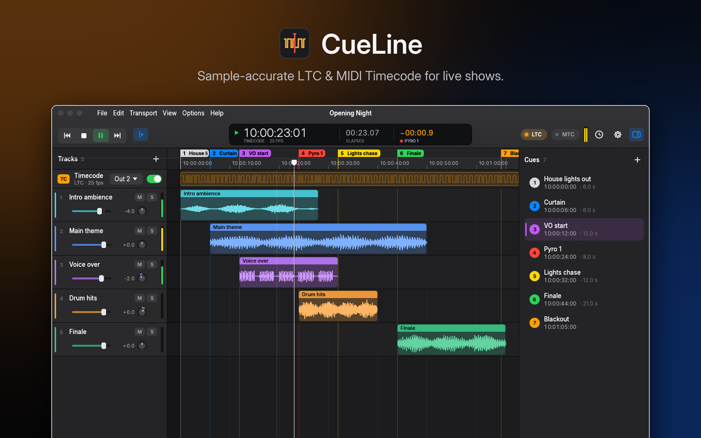
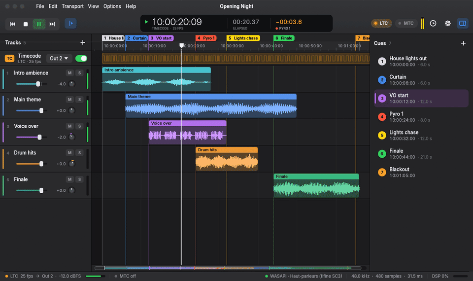
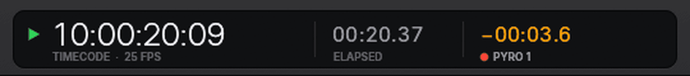
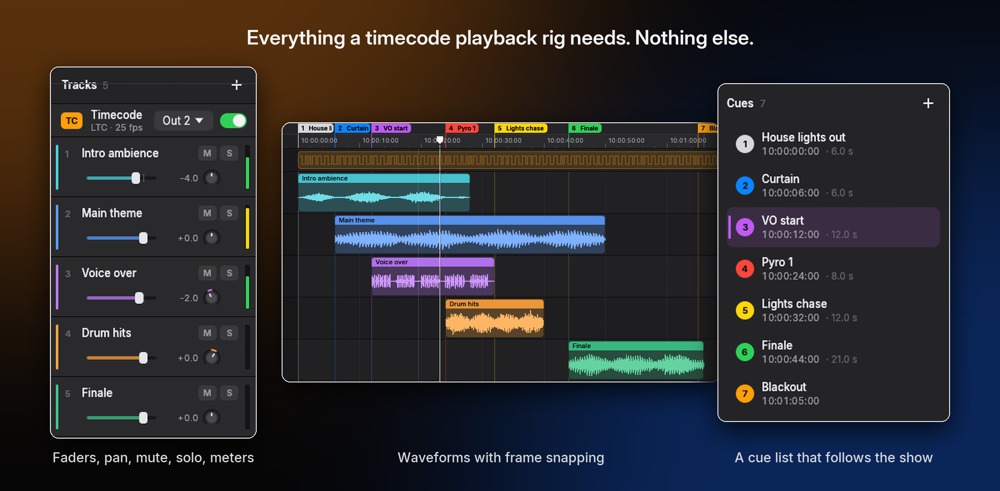
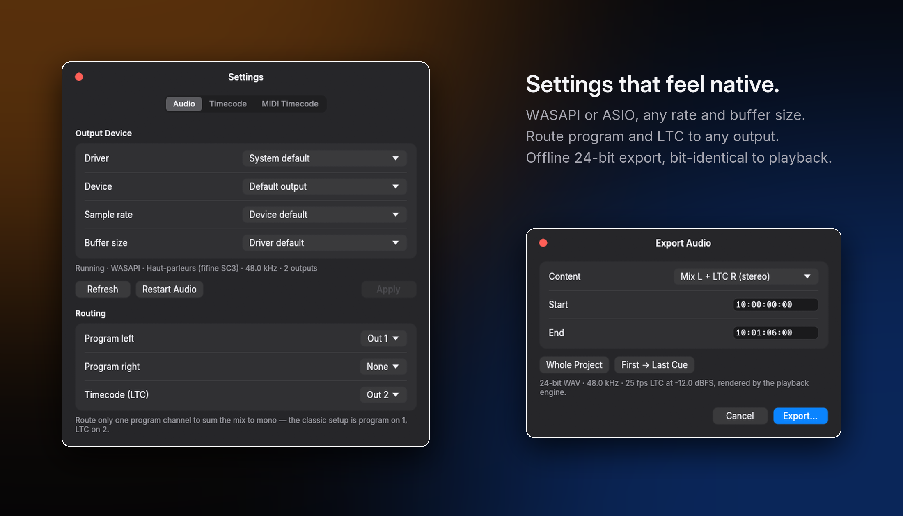

<div align="center">


# CueLine

**Sample-accurate SMPTE LTC & MIDI Timecode for live shows.**<br>
Load your show audio, drop your cues, press <kbd>Space</kbd>, and lights, video and pyro follow in sync.

[](https://github.com/naileclevrai/CueLine/actions/workflows/ci.yml)
[](https://github.com/naileclevrai/CueLine/releases)
[](LICENSE)
[](#download)
[](https://www.rust-lang.org)
<br>
[](#timing-you-can-trust)
[](#timing-you-can-trust)
[](#features)
[](#download)

[**Download**](#download) · [Features](#features) · [Timing](#timing-you-can-trust) · [Shortcuts](#keyboard-shortcuts) · [Build](#build-from-source) · [Architecture](docs/ARCHITECTURE.md)

<br>



</div>

<br>

## See it in action

<div align="center">

<br><sub>Live playback: the cue list follows the show and the countdown turns orange five seconds before the next cue.</sub>
</div>

<br>

CueLine keeps the parts of a DAW that matter for timecode playback (tracks, waveforms, cues, a
timecode ruler) and drops everything else. It ships as **one small executable**, with no installer,
runtime or plug-ins, and it is built around one goal: **the timecode is exactly where the audio is.**

## Features

<table>
<tr>
<td width="50%" valign="top">

### 🎯 Timecode first
- **LTC generated inside the audio callback**, in the same buffer as your tracks: it can't drift,
  and seeking, pausing or changing the buffer size never produces a broken frame.
- **MIDI Timecode** scheduled on a time-critical thread against the real audio clock.
- **23.976, 24, 25, 29.97 DF, 29.97 ND and 30 fps**, any start timecode, LTC user bits.

</td>
<td width="50%" valign="top">

### 🎚️ A real timeline
- Multitrack playback with **waveforms**, volume faders, pan, mute and solo.
- Sample-exact clip offsets with **frame snapping** (<kbd>Shift</kbd> to bypass).
- **Cue list** with live highlight, colours, drag-to-move and a countdown.

</td>
</tr>
<tr>
<td width="50%" valign="top">

### 🔌 Fits any rig
- **WASAPI** by default, optional **ASIO**; any sample rate and buffer size.
- Route the program and LTC to **any output**. The classic stereo setup is *music left, LTC
  right*.
- Automatic **reconnection** when an interface drops out.

</td>
<td width="50%" valign="top">

### ✨ Pro comfort
- **Big timecode window** for a second screen at FOH or on stage.
- **Offline 24-bit WAV export**, bit-identical to live playback.
- Undo/redo, drag & drop, Reaper-style shortcuts, and a native-feeling dark interface.

</td>
</tr>
</table>

<div align="center">

</div>

<br>



<br>



## Timing you can trust

Every claim below is enforced by the test suite (`cargo test --workspace`).

| | Guarantee | How it is verified |
| --- | --- | --- |
| **LTC frame boundaries** | within **2 samples** of the theoretical position | Encode, then decode 3 s at every frame rate and at 44.1 / 48 / 96 kHz |
| **LTC continuity** | identical output whatever the buffer size | Bit-for-bit comparison of 1 large buffer vs 37-sample chunks |
| **Drop-frame labels** | every frame of a full hour round-trips | Exhaustive 29.97 DF conversion test |
| **MTC scheduling** | each quarter-frame within **1 ms** (typically 10–250 µs) | Messages timestamped against the audio clock |
| **Clock filtering** | ±1 ms callback jitter reduced to **< 150 µs** | DLL simulation with a 200 ppm fast device |
| **Export** | bit-identical to playback | The exporter drives the live mixer, and its file is decoded back |

See [docs/ARCHITECTURE.md](docs/ARCHITECTURE.md) for the design: a lock-free real-time
thread, stateless LTC synthesis and a DLL-filtered audio clock.

## Download

1. Grab **`CueLine.exe`** from the [releases page](https://github.com/naileclevrai/CueLine/releases).
2. Run it. There is nothing to install.
3. Drop audio files on the window, choose your outputs in **Settings** (<kbd>Ctrl</kbd>+<kbd>,</kbd>)
   and press <kbd>Space</kbd>.

Projects are plain `.cueline` JSON files that store media paths relative to the project, so a show
folder can be copied from one machine to another. Preferences live in
`%APPDATA%\CueLine\settings.json`.

## Keyboard shortcuts

| Keys | Action | Keys | Action |
| --- | --- | --- | --- |
| <kbd>Space</kbd> | Play / stop (back to start) | <kbd>M</kbd> | Add cue at playhead |
| <kbd>Shift</kbd>+<kbd>Space</kbd> | Pause here | <kbd>[</kbd> / <kbd>]</kbd> | Previous / next cue |
| <kbd>Home</kbd> / <kbd>End</kbd> | Project start / end | <kbd>1</kbd> … <kbd>9</kbd> | Jump to cue *n* |
| <kbd>←</kbd> / <kbd>→</kbd> | ± 1 frame (<kbd>Shift</kbd>: 1 s) | <kbd>G</kbd> | Go to timecode |
| <kbd>F</kbd> | Follow playhead | <kbd>B</kbd> | Big timecode window |
| <kbd>Z</kbd> | Zoom to project | <kbd>Ctrl</kbd>+Wheel | Zoom |
| <kbd>Ctrl</kbd>+<kbd>Z</kbd> / <kbd>Y</kbd> | Undo / redo | <kbd>Ctrl</kbd>+<kbd>E</kbd> | Export WAV |

## Build from source

Requires a stable [Rust toolchain](https://rustup.rs) and, on Windows, the MSVC build tools.

```bash
cargo build --release
```

The executable ends up at `target/release/CueLine.exe`. To run the tests:

```bash
cargo test --workspace
```

<details>
<summary><b>ASIO support (optional)</b></summary>

<br>

Install LLVM and download the Steinberg ASIO SDK, point `CPAL_ASIO_DIR` at it, then:

```bash
cargo build --release --features asio
```

</details>

<details>
<summary><b>Documentation screenshots</b></summary>

<br>

CueLine can render itself to an image without any screen capture (audio output is muted):

```bash
CUELINE_SCREENSHOT=shot.ppm CUELINE_SCREENSHOT_SEEK=20 CUELINE_SCREENSHOT_PLAY=3 cargo run --release -- show.cueline
```

`CUELINE_SCREENSHOT_FRAMES` and `CUELINE_SCREENSHOT_INTERVAL` record an image sequence for GIFs.

</details>

## En français

CueLine est un lecteur de timeline léger, centré sur le timecode. Il génère un **LTC SMPTE calé à
l'échantillon** dans le même flux audio que vos pistes, et un **MIDI Timecode** planifié sur
l'horloge audio réelle (erreur mesurée inférieure à 1 ms). Il offre des pistes avec formes d'onde,
une liste de cues avec compte à rebours, le routage des sorties, l'export WAV et une fenêtre de
timecode géante pour la régie. Le tout tient dans un seul exécutable d'environ 9 Mo, sans
installation.

## Contributing

Issues and pull requests are welcome. Please read [CONTRIBUTING.md](CONTRIBUTING.md) first: the
real-time thread has strict rules (no allocation, no locks).

## License

CueLine is released under the [MIT](LICENSE) license.

The interface uses Apple's San Francisco font **only when it is already installed** on the machine
(it is read at runtime and never redistributed). Otherwise it uses the embedded
[Inter](https://rsms.me/inter/) typeface, © The Inter Project Authors, under the
[SIL Open Font License 1.1](assets/fonts/OFL.txt). No Apple font is included in this repository or
in release builds.
